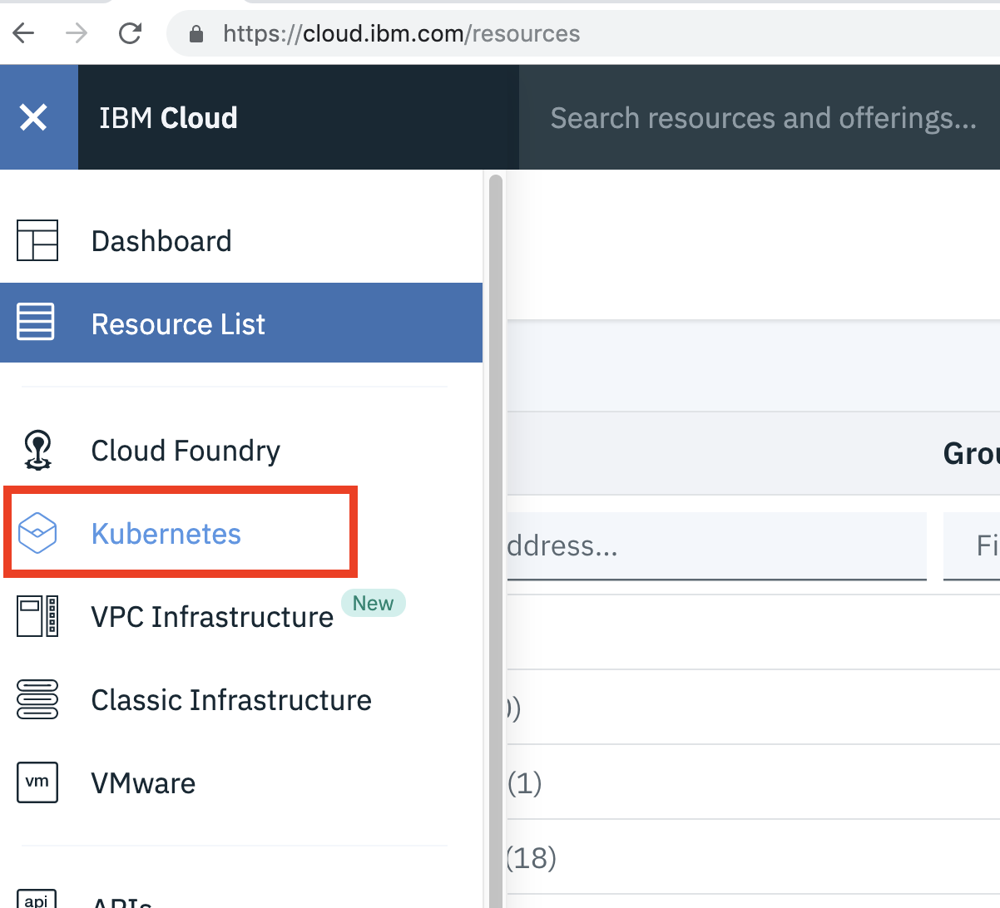
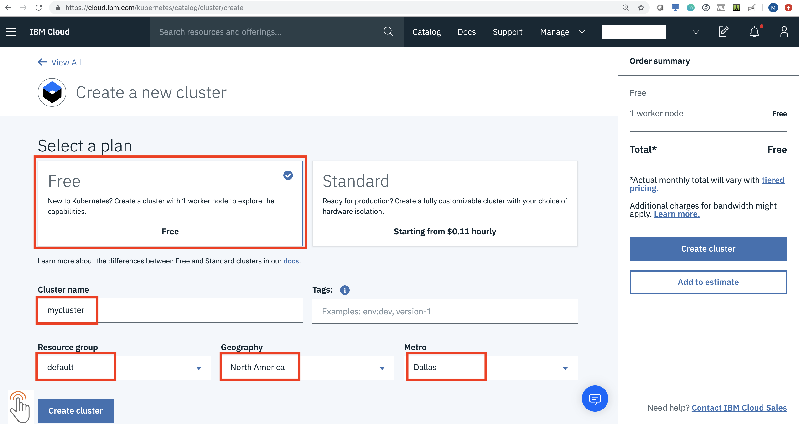
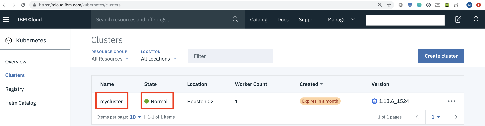
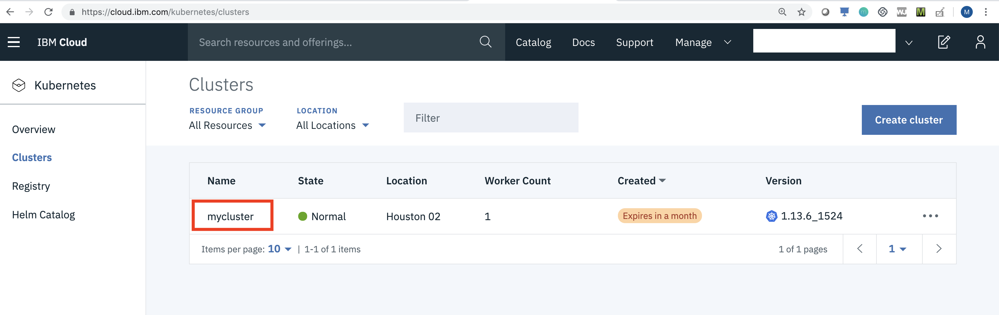
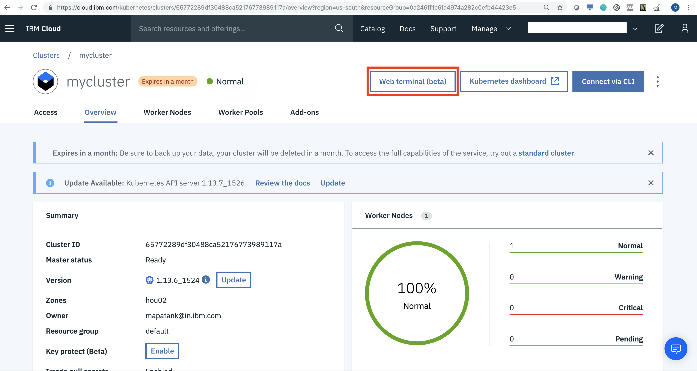
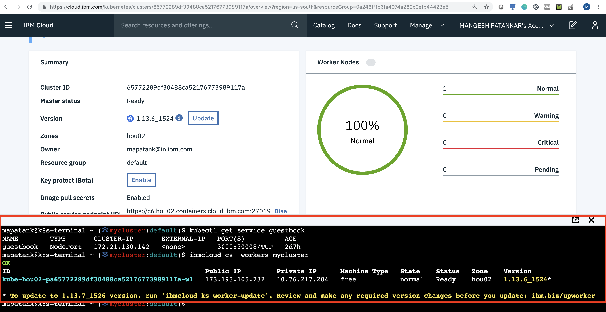

# Advance Cloud Workshop 


## 0. Register on IBM Cloud

https://ibm.biz/BdzPaf


After successful registration Login into your account. 


## 1. Convert the IBM Cloud Lite account to Trial account

You will be provided with PROMO Code. 
Account -- Apply Promo Code

For instructions on how to apply the codes, 
review this page
[IBM Cloud Sign up and PROMO Code](https://cloud.ibm.com/docs/account?topic=account-codes#codes)


## 2. Provision a Kubernetes Cluster on IBM Cloud

From Dashboard menu, select Kubernetes.



After that click on "Create Cluster", you will be asked following details to enter.
a - Select Free Cluster
b - Give a cluster name
c - Select Geography as North America and Select Dallas with default resource group
     

     
Once the cluster is provisioned, Cluster will be shown in Normal State. 
     
     


## 3. Access Kubernetes Cluster using Web Terminal

Once the cluster is provisioned, the kubernetes client CLI `kubectl` needs to be
configured to talk to the provisioned cluster.

This can also be done using your local desktops. You will have to install IBM Cloud Plugin Tools for doing that.

For this lab, you will be using Web Terminal, to work with your cluster. So installations on client machines is not required.
This feature is in beta currently. 

a. Access the Cluster, and go to Cluster details
   

b. Click on "Web terminal(beta) "
 

c. Web based terminal opens at the bottom of the browser.     
       
     
     
Once your open the Web based terminal, you are ready to explore Kubernetes Objects.

## Lab

## Pod: Managing pods with kubectl

Creating the pod manually.

You will be creating Pod manually using YAML File.

```
	 kubia-manual.yaml
	 
	 kubectl apply -f  kubia-manual.yaml
	 
```

Please use file from this repository


## ReplicaSet: 

Creating ReplicaSet.

This replicaset will create 3 pods of kubia automatically.

```
  kubia-rs.yaml
 
  kubectl apply -f kubia-rs.yaml
 
```

This is not manual creation of Pods.

You will use kubia-rs.yaml file to Create ReplicaSet


## Service: 

For creating Service, you will be using kubia-svc.yaml file.

```
	 kubia-svc.yaml
	 	
	 kubectl apply -f kubia-svc.yaml
```

This will create a Kubia Service. This will internally use the Pods for loadbalancing this service.

To test how this calls the service

You will have to get service
```
$ kubectl get svc
NAME         CLUSTER-IP       EXTERNAL-IP   PORT(S)   AGE
kubernetes   10.111.240.1     <none>        443/TCP   30d
kubia        10.111.249.153   <none>        80/TCP    6m        1

```

Note the IP address ( Cluster IP) of service - 10.111.249.153 


```
$ kubectl get pods

NAME          READY   STATUS    RESTARTS   AGE
kubia-5l4q5   1/1     Running   0          18m
kubia-8k645   1/1     Running   0          18m
kubia-rvm48   1/1     Running   0          18m

```

Now lets try to test using curl

```
$ kubectl exec kubia-5l4q5 -- curl -s http://10.111.249.153
You've hit kubia-5l4q5

```

If you go on running this commands, you will observe it hits different pods, 

## Congratulations!!!!, You have successfully completed the lab 


